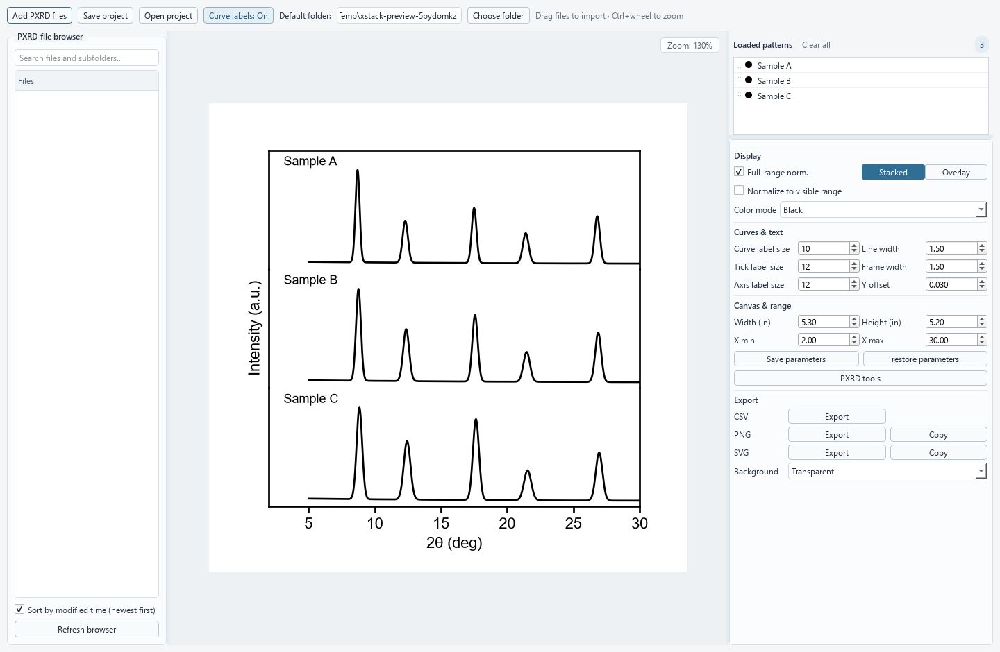

# xStack · PXRD Viewer

用于粉末 X 射线衍射（PXRD）数据查看、堆叠比较、绘图与基础峰分析的桌面应用。

A desktop application for viewing, comparing, plotting, and performing basic peak analysis on powder X-ray diffraction (PXRD) patterns.

**当前发布版本 / Current release: 1.5**


## 界面预览 / Preview



*使用模拟 PXRD 数据展示实际应用界面；非实验测量结果。 / Actual application interface with synthetic PXRD data, not experimental measurements.*

[中文说明](#中文说明) · [English guide](#english-guide)

## 中文说明

### 1. 功能概览

- 批量导入 PXRD 文件，支持文件浏览器、拖放导入及曲线列表拖动排序。
- 支持堆叠（Stacked）与叠加（Overlay）显示，调节曲线倍率、偏移、颜色及标签。
- 提供全局归一化和随可见 X 区间更新的实时归一化。
- 交互缩放、平移、文本编辑，以及最多 30 步的快照式撤销。
- 内置 Savitzky–Golay、移动平均、高斯平滑、arPLS 背景扣除及峰分析。
- 导出 CSV、SVG、PNG，并可将 SVG/PNG 复制到剪贴板。
- 使用 `.pxrdproj` 保存曲线数据与绘图状态，便于继续编辑。
- 外部打开数据时可复用当前窗口，并在后台读取文件、在主线程更新绘图。

### 2. 安装与启动

#### Windows 安装版与便携版

当前打包配置面向 **64 位 Windows 10/11**。完成构建后，文件位于 `release/1.5/`：

| 文件 | 用途 |
| --- | --- |
| `xStack-1.5-Setup.exe` | 按用户安装，含开始菜单入口、可选桌面快捷方式及卸载程序，无需管理员权限 |
| `xStack-1.5-Portable.exe` | 单文件便携版，无需安装 Python；启动时解压依赖到临时目录 |
| `xStack-1.5/` | 安装器使用的程序目录；直接运行其中的 `xStack.exe` 时需保留 `_internal` |

构建产物不纳入 Git，源码检出后需要自行构建或另行取得发布包。当前构建未进行代码签名。

#### 从源码运行

本项目现有启动与打包脚本使用 Windows Python 3.14。其他 Python 版本或操作系统未在此声明兼容性保证。运行依赖为 NumPy、Matplotlib、PyQt6、SciPy；项目目前没有锁定依赖版本。

在项目目录打开 PowerShell，创建独立环境并启动：

```powershell
py -3.14 -m venv .venv
.\.venv\Scripts\python.exe -m pip install --upgrade pip
.\.venv\Scripts\python.exe -m pip install numpy matplotlib PyQt6 scipy
.\.venv\Scripts\python.exe .\xStack.py
```

也可以双击 `run_xStack.bat`。它默认调用 `%LOCALAPPDATA%\Programs\Python\Python314\python.exe`，不会自动使用 `.venv`；若使用其他解释器，请修改 BAT 内的 `XSTACK_PYTHON`。保持 `xstack_ui.py` 与主程序位于同一目录。

### 3. 基本使用流程

1. 使用 **Choose Folder** 选择浏览目录，或用 **Add PXRD Files** 添加文件；也可直接拖入数据文件。
2. 在曲线列表中选择曲线，拖动列表项改变顺序；悬停查看来源路径、标签、颜色与倍率。
3. 在右侧检查器选择 **Stacked / Overlay**，并调整 Display、Curves & text、Canvas & range 等参数。
4. 需要处理数据时打开 **PXRD Tools**，选择工具及参数，检查预览后点击 **Apply**。
5. 使用 **Save Project** 保存可继续编辑的会话；使用 CSV 导出数据，或 SVG/PNG 导出当前图像。

**Choose Folder** 的目录会在下次启动时恢复；外部传入文件不会改变此目录偏好。重复加载的文件会按现有导入规则跳过。

### 4. 支持的数据格式

| 类型 | 扩展名 | 读取方式与限制 |
| --- | --- | --- |
| 两列文本 | `.txt`、`.dat`、`.xy`、`.xye`、`.chi`、`.asc`、`.uxd`、`.ras`、`.csv` | 每行前两列解析为 `2θ, intensity`；支持空白或逗号分隔，忽略无法解析及非有限数值行；额外列不参与绘图 |
| RAW | `.raw` | 先尝试文本，再尝试支持的 Bruker / Rigaku 二进制解析器 |
| XRDML | `.xrdml` | 从 XML 的 `dataPoints` 中读取强度与位置 |
| 项目 | `.pxrdproj` | 恢复已保存的数据和界面状态，不是普通两列数据文件 |

可读取的简单文本示例（角度单位为度）：

```text
2theta intensity
5.00 125
5.02 138
5.04 164
```

RAW 解析包含 Bruker `RAW `、`RAW2`、`RAW1.01`、`RAW4.00` 签名，以及带 `DA\0\0` 数据块的 Rigaku SmartLab 风格 `FI\0\0` 文件。厂商格式存在变体，扩展名相同不代表均可读取；失败时可从仪器软件导出两列文本。文本格式采用通用两列读取，并非每种扩展名都有完整的厂商专用解析器。

### 5. 鼠标与快捷键

| 操作 | 效果 |
| --- | --- |
| 在绘图区空白处按住左键拖动 | 缩放 X 轴区间 |
| 按住中键拖动 | 沿 X 轴平移 |
| 双击绘图区空白处 | 恢复完整视图 |
| 双击曲线标签 | 编辑标签文字 |
| 双击标题或轴标签 | 编辑对应文字 |
| 双击曲线 | 修改颜色 |
| 滚轮 | 调整选中曲线倍率；未选择曲线时调整全部曲线 |
| `Ctrl+Shift+C` | 复制当前图为 SVG |
| `Ctrl+Z` | 撤销，最多保留 30 个快照 |
| `Delete` | 移除选中曲线 |

### 6. 归一化、处理与数据含义

**实时归一化：** 在 Display 中开启后，每条曲线按当前可见 X 区间内的最大强度归一化。缩放、平移或更改范围会自动更新，且优先于全局 Normalize。可见区间没有采样点时使用全曲线最大值；最大值为零或负数时不做除法。该选项随项目保存。

归一化、手动倍率和显示偏移只改变图像，不改变存储的数据数组。CSV 导出不包含这些显示变换。

**PXRD Tools：** 小画布实时预览，在点击 Apply 前不更改主数据。

| 工具 | 说明 |
| --- | --- |
| Savitzky–Golay | 多项式平滑，有效窗口为奇数；依赖 SciPy |
| Moving Average | 移动平均平滑 |
| Gaussian | 高斯平滑；依赖 SciPy |
| Background Subtraction | arPLS 背景估计与扣除；依赖 SciPy |
| Peak Analysis | 峰位置、强度、Bragg 晶面间距、FWHM 及 Scherrer 晶粒尺寸估算 |

应用平滑或扣背景会更新会话中的曲线数据，并以 `_smooth` 或 `_BS` 标记曲线名。因此，**CSV 导出的是当前会话的数据点；经过 Apply 处理后不再等同于最初导入的数据**。这些操作不会回写源数据文件，可通过撤销恢复先前状态。

峰分析默认波长为 1.5406 Å，可在界面修改；使用前应设置与测量一致的波长和 Scherrer K。尺寸结果是峰宽计算的估算值，不等同于完整结构精修或独立粒径测量。

### 7. 导出与项目保存

- **CSV：** 每条曲线对应一对 `2theta` / `intensity` 列，表头包含序号和标签；保留当前数据点、不插值，长度不足的列用空单元格补齐。多曲线 CSV 是宽表，通用两列导入器只读取前两列；完整会话请用项目格式保存。
- **SVG / PNG：** 按当前画布状态导出，可选择透明或白色背景；剪贴板操作是否保留矢量格式取决于目标软件。
- **`.pxrdproj`：** ZIP 容器，包含 `project.json`（界面设置、标签、颜色、范围、顺序等）与 `data/uid_*.npz`（每条曲线的压缩 X/Y 数组）。数据随项目保存，恢复曲线不依赖原始文件仍在原位置。

外部传入项目可在空窗口中恢复；已有曲线时，请明确使用 **Open Project** 替换当前会话。

### 8. 外部打开与默认程序

可以将多个数据文件拖到 BAT 或 EXE 上，也可通过命令行传入路径。已经运行时会将文件交给现有窗口，保留现有曲线和绘图参数。

```powershell
.\.venv\Scripts\python.exe .\xStack.py "D:\PXRD data\sample1.xy" "D:\PXRD data\sample2.xy"
.\release\1.5\xStack-1.5-Portable.exe "D:\PXRD data\sample1.xy"
```

Windows 文件关联需手动设置：将程序放在固定位置，在数据文件右键菜单中选择“打开方式 → 选择其他应用”，选取安装后的 `xStack.exe` 或便携 EXE，并设为始终使用。不同扩展名需分别设置，当前安装脚本不自动注册这些关联。

### 9. Windows 打包

当前发布入口为 `packaging/build.ps1`，使用 `packaging/xstack.spec` 构建目录版和单文件便携版。

准备好运行依赖后，为所用 Python 安装 PyInstaller，并准备 Inno Setup 编译器：

```powershell
.\.venv\Scripts\python.exe -m pip install pyinstaller
.\packaging\build.ps1 -Python "$PWD\.venv\Scripts\python.exe" -Compiler "C:\Program Files (x86)\Inno Setup 6\ISCC.exe"
```

`-Compiler` 必须指向实际安装的 `ISCC.exe`。脚本默认使用本机 Python 3.14 和 `.build-tools/inno/ISCC.exe`，并把 `.build-tools` 加入构建时的 Python 模块路径；这些本地工具不随仓库分发。现有打包记录使用 Inno Setup 6.7.3。

脚本先运行 `packaging/xstack.spec` 生成目录版与便携版，再运行 `packaging/xstack.iss` 生成安装器，最后输出两个 EXE 的 SHA-256。中间文件位于 `build/release-1.5/`，发布文件位于 `release/1.5/`。更多说明见 [packaging/README.md](packaging/README.md)。

### 10. 测试与维护

在已安装运行依赖的环境执行：

```powershell
.\.venv\Scripts\python.exe -m unittest test_file_open test_ui test_data_safety test_live_normalization test_performance
```

测试覆盖文件打开与窗口复用、界面行为、数据安全、实时归一化以及增量绘图行为。它们不代表对所有厂商 RAW 文件或硬件性能的全面验证。打包后可额外运行 Windows EXE 冒烟检查：

```powershell
.\.venv\Scripts\python.exe .\packaging\smoke_frozen.py .\release\1.5\xStack-1.5-Portable.exe
```

### 11. 常见问题

| 问题 | 处理方式 |
| --- | --- |
| BAT 提示找不到 Python | 修改 `XSTACK_PYTHON`，或使用上面的虚拟环境命令 |
| 缺少 NumPy、PyQt6 等模块 | 使用启动程序的同一解释器执行 `-m pip install` |
| RAW 或文本文件无法读取 | 检查是否包含有效两列数据，必要时从仪器软件重新导出 |
| 导出的 CSV 与图中高度不同 | CSV 不包含显示归一化、倍率和偏移；图像请导出 SVG/PNG |
| 便携版启动较慢 | 单文件版本需先解压依赖，可改用安装版 |
| 大文件夹搜索仍有停顿 | 搜索有输入防抖，但目录扫描仍运行在界面线程 |

## English guide

### 1. Features

- Import multiple PXRD patterns through the file browser, file dialog, or drag and drop; drag list entries to reorder them.
- Compare patterns in **Stacked** or **Overlay** mode with editable scales, offsets, colors, and labels.
- Use global normalization or live normalization based on the visible X range.
- Zoom, pan, edit plot text, and undo changes with up to 30 snapshots.
- Apply Savitzky–Golay, moving-average, and Gaussian smoothing, arPLS background subtraction, and basic peak analysis.
- Export CSV, SVG, and PNG; copy SVG/PNG to the clipboard; save editable `.pxrdproj` sessions.
- Reuse the running window when opening files externally. Data loading runs in a background thread, while plotting stays on the UI thread.

### 2. Installation and launch

The current packaging configuration targets **64-bit Windows 10/11**. Build outputs appear under `release/1.5/`:

| Output | Purpose |
| --- | --- |
| `xStack-1.5-Setup.exe` | Per-user installer, Start menu entry, optional desktop shortcut, and uninstaller; no administrator access required |
| `xStack-1.5-Portable.exe` | Standalone EXE; no Python installation required; extracts dependencies to a temporary directory at launch |
| `xStack-1.5/` | Installer payload; retain `_internal` beside `xStack.exe` when running this folder directly |

Generated packages are excluded from Git. Build them from source or obtain a release package separately. The current build is unsigned.

The existing launch/build scripts use Windows Python 3.14. Compatibility with other Python versions or operating systems is not established here. Runtime dependencies are NumPy, Matplotlib, PyQt6, and SciPy; dependency versions are not currently pinned.

From the project directory in PowerShell:

```powershell
py -3.14 -m venv .venv
.\.venv\Scripts\python.exe -m pip install --upgrade pip
.\.venv\Scripts\python.exe -m pip install numpy matplotlib PyQt6 scipy
.\.venv\Scripts\python.exe .\xStack.py
```

Alternatively, double-click `run_xStack.bat`. It uses `%LOCALAPPDATA%\Programs\Python\Python314\python.exe`, not the virtual environment automatically. Edit its `XSTACK_PYTHON` value to select another interpreter. Keep `xstack_ui.py` beside the entry point.

### 3. Typical workflow

1. Select a directory with **Choose Folder**, click **Add PXRD Files**, or drop data files into the window.
2. Select and reorder patterns in the list. Hover over an entry to inspect its source path, label, color, and scale.
3. Choose **Stacked / Overlay** and adjust the Display, Curves & text, and Canvas & range controls in the inspector.
4. Open **PXRD Tools**, inspect the live preview, and click **Apply** to commit processing.
5. Use **Save Project** to retain an editable session, CSV for numerical data, or SVG/PNG for the current figure.

The directory selected with **Choose Folder** is remembered across launches. Externally opened files do not change that preference. Already loaded files are skipped according to the existing import rules.

### 4. Supported formats

| Type | Extensions | Behavior |
| --- | --- | --- |
| Two-column text | `.txt`, `.dat`, `.xy`, `.xye`, `.chi`, `.asc`, `.uxd`, `.ras`, `.csv` | Reads the first two columns as `2theta, intensity`; accepts whitespace or commas; skips invalid/nonfinite rows and ignores additional columns |
| RAW | `.raw` | Tries text, then supported Bruker/Rigaku binary parsers |
| XRDML | `.xrdml` | Reads intensities and positions from XML `dataPoints` |
| Session | `.pxrdproj` | Restores saved data and UI state |

A minimal text file uses angles in degrees:

```text
2theta intensity
5.00 125
5.02 138
5.04 164
```

Binary support includes Bruker signatures `RAW `, `RAW2`, `RAW1.01`, and `RAW4.00`, and Rigaku SmartLab-style `FI\0\0` files with a `DA\0\0` payload. Vendor variants may not parse. Export two-column text from the instrument software when needed. Text extensions use a generic two-column reader, not a complete vendor-specific parser for each format.

### 5. Mouse and keyboard controls

| Action | Result |
| --- | --- |
| Left-drag on blank plot space | Zoom the X range |
| Middle-drag | Pan along X |
| Double-click blank plot space | Reset the full view |
| Double-click a curve label | Edit its text |
| Double-click the title or an axis label | Edit the corresponding text |
| Double-click a curve | Change its color |
| Mouse wheel | Scale the selected curve, or all curves when none is selected |
| `Ctrl+Shift+C` | Copy the current figure as SVG |
| `Ctrl+Z` | Undo, with up to 30 snapshots |
| `Delete` | Remove the selected curve |

### 6. Normalization and processing

**Live normalization** scales each curve by its maximum intensity within the visible X range. It updates when zooming, panning, or editing the range and takes precedence over global Normalize. If the visible range has no samples, the full-curve maximum is used. Division is skipped when the maximum is zero or negative. This setting is saved with the project.

Normalization, manual scale, and display offsets affect rendering only; they do not change stored arrays and are not included in CSV exports.

**PXRD Tools** previews changes on a small canvas without modifying main data until **Apply**:

| Tool | Purpose |
| --- | --- |
| Savitzky–Golay | Polynomial smoothing with an effective odd window; requires SciPy |
| Moving Average | Moving-average smoothing |
| Gaussian | Gaussian smoothing; requires SciPy |
| Background Subtraction | arPLS baseline estimation and subtraction; requires SciPy |
| Peak Analysis | Peak position, intensity, Bragg d-spacing, FWHM, and a Scherrer size estimate |

Applying smoothing or background subtraction updates session arrays and tags curve names with `_smooth` or `_BS`. **CSV exports the current session data points, which include processing already applied.** It does not necessarily reproduce the originally imported intensities. Processing does not overwrite source files; undo restores an earlier session state.

Peak analysis defaults to a wavelength of 1.5406 Å. Set the wavelength and Scherrer K to match the measurement. The size is a peak-width-based estimate, not a full structural refinement or an independent particle-size measurement.

### 7. Exports and projects

- **CSV:** One `2theta` / `intensity` column pair per curve, with index and label in the headers. Points are exported without interpolation; shorter curves are padded with empty cells. Multi-curve CSV is a wide table: the generic text importer reads only its first two columns. Use the project format to preserve the full session.
- **SVG / PNG:** Export the current canvas with a transparent or white background. Clipboard vector support depends on the receiving application.
- **`.pxrdproj`:** A ZIP container with `project.json` for UI state, labels, colors, ranges, and order, plus `data/uid_*.npz` for compressed curve X/Y arrays. Embedded data allows restoration even if original source files move.

An externally opened project can be restored in an empty window. If curves are already loaded, explicitly use **Open Project** to replace the session.

### 8. External opening and file associations

Drop files onto the BAT/EXE or pass quoted paths on the command line. When an instance is running, external files are forwarded to that window while retaining existing curves and plot settings.

```powershell
.\.venv\Scripts\python.exe .\xStack.py "D:\PXRD data\sample1.xy" "D:\PXRD data\sample2.xy"
.\release\1.5\xStack-1.5-Portable.exe "D:\PXRD data\sample1.xy"
```

For Windows file associations, keep the executable in a permanent location, right-click a data file, select **Open with → Choose another app**, choose the installed `xStack.exe` or portable EXE, and select **Always**. Repeat for each extension. The installer does not automatically register these associations.

### 9. Building Windows packages

Use `packaging/build.ps1` for version 1.5. It uses `packaging/xstack.spec` to build both folder and single-file portable editions.

After installing runtime dependencies, install PyInstaller into the selected environment and provide an Inno Setup compiler:

```powershell
.\.venv\Scripts\python.exe -m pip install pyinstaller
.\packaging\build.ps1 -Python "$PWD\.venv\Scripts\python.exe" -Compiler "C:\Program Files (x86)\Inno Setup 6\ISCC.exe"
```

Adjust `-Compiler` to the actual `ISCC.exe` location. Defaults use the local Python 3.14 installation and `.build-tools/inno/ISCC.exe`; `.build-tools` is added to the build-time Python module path. Local tools are not distributed in Git. The existing packaging record uses Inno Setup 6.7.3.

The script runs `packaging/xstack.spec` for folder and portable outputs, then `packaging/xstack.iss` for the installer, and prints SHA-256 hashes for both distributable EXEs. Intermediates go to `build/release-1.5/`; outputs go to `release/1.5/`. See [packaging/README.md](packaging/README.md).

### 10. Tests and maintenance

Run the regression suite in an environment with runtime dependencies installed:

```powershell
.\.venv\Scripts\python.exe -m unittest test_file_open test_ui test_data_safety test_live_normalization test_performance
```

Coverage includes external opening/window reuse, UI behavior, data safety, live normalization, and incremental plotting behavior. This is not exhaustive vendor-format validation or a hardware performance benchmark. After packaging, an additional Windows frozen-app smoke check is available:

```powershell
.\.venv\Scripts\python.exe .\packaging\smoke_frozen.py .\release\1.5\xStack-1.5-Portable.exe
```

### 11. Troubleshooting

| Symptom | Action |
| --- | --- |
| BAT cannot find Python | Edit `XSTACK_PYTHON` or use the virtual-environment commands above |
| Missing NumPy, PyQt6, or another module | Install it with `-m pip` using the same interpreter that launches the app |
| A RAW/text file cannot be read | Check for valid two-column data or export text from the instrument software |
| CSV intensities differ from displayed heights | CSV omits display normalization, scaling, and offsets; export SVG/PNG for the visual result |
| Portable startup is slower | The single EXE extracts dependencies first; use the installed edition if preferred |
| Searching a large directory briefly pauses the UI | Search input is debounced, but directory scanning still runs on the UI thread |

## 项目结构 / Project structure

```text
8_xStack/
├── README.md
├── .gitignore
├── xStack.py                   # 主程序、数据处理与绘图 / Application and processing
├── xstack_ui.py                # Qt 样式与界面构建 / Qt styling and UI builders
├── run_xStack.bat              # 本机源码启动器 / Local source launcher
├── test_*.py                   # 回归测试 / Regression tests
├── docs/images/                # README 界面截图 / README screenshots
├── xStack.png / *.ico          # 应用图标 / Application icons
├── starting_fig.png            # 启动画面 / Splash artwork
├── packaging/                 # 1.5 构建脚本与元数据 / Release build configuration
├── branding/                  # 启动画面源文件与生成器 / Splash sources and generator
├── design-crystal-icon/        # 图标源文件与生成器 / Icon sources and generators
├── _archive/                  # 历史材料 / Historical materials
├── .build-tools/               # 本地工具，忽略 / Local tools, ignored
├── build/                     # 构建中间文件，忽略 / Build intermediates, ignored
└── release/                   # 发布产物，忽略 / Release outputs, ignored
```

`_archive/2026-09-23-cleanup/manifest.json` 记录清理前后路径；归档源码不是当前启动入口。整个历史归档目录由 `.gitignore` 排除，仅在本地保留，不随源码仓库分发。

`_archive/2026-09-23-cleanup/manifest.json` records original and archived paths. Archived source is not the current entry point. The entire historical archive is ignored and retained locally; it is not distributed with the source repository.

`.gitignore` 排除缓存、虚拟环境、构建/发布目录、日志及本地会话文件，保留源代码、测试、打包配置及当前品牌源文件；忽略设计草稿、预览图与重复生成图片，并覆盖上级目录对 PNG / `.spec` 的广泛忽略。科学数据格式（如 CSV、XY、RAW）不做一刀切忽略；本地实验文件可放入被忽略的 `local-data/`，临时导出可放入 `exports/`。忽略规则不会自动停止跟踪已提交的文件。

The ignore rules exclude caches, virtual environments, build/release directories, logs, and local sessions while retaining code, tests, packaging configuration, and current branding sources. Design drafts, preview images, and duplicate rendered assets are ignored. They override inherited blanket PNG/`.spec` ignores. Scientific formats such as CSV, XY, and RAW are not globally ignored; use ignored `local-data/` and `exports/` folders for local measurements and temporary exports. Ignore rules do not untrack files already committed.

## 作者与致谢 / Author and attribution

- **作者 / Author:** Yu-Lin Lu
- **ORCID:** [0000-0001-9846-8127](https://orcid.org/0000-0001-9846-8127)
- **AI 辅助 / AI assistance:** 代码及文档使用了 AI 辅助。The code and documentation were developed with AI assistance.
